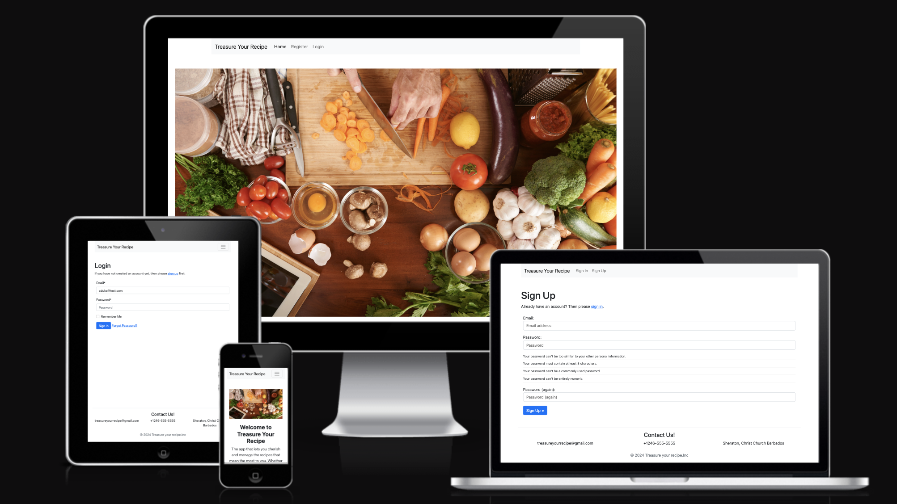

# Treasure Your Recipe

> [Live Site](https://treasure-your-recipe-812ee6481b1f.herokuapp.com/)

## Project Overview
This project was created due to my love for cooking. My family has hundreds for secret recipes sent down from generations. Saving these recipes or as i like to call it "treasuring these recipes' is very important to me. This gave me the idea to create an app that will allow me to store these recipes all these fantastic recipes in one place so you can never lose them.

## Wireframes

- Landing page

- Dashboard

- Create Recipe Page

## User Stories
> [Link here to user Stories on github](https://github.com/AyishaSandiford/treasure-your-recipe-pp4/issues?q=is%3Aissue+is%3Aclosed)

## Features

Screenshot of The Login Form

 

Screenshot of The Signup Form

 

Screenshot of The Dashboard

 

Screenshot of The Create recipe Page

 

Screenshot of The Edit Page

 

Screenshot of The Delete message

## Future Features
This application was created with minimal functionality (MVP). Just enought to 
present to the client to help get a general idea of sites functionality.
The intendtion of this application is to continue to build on it allowing
more features in the future.
See some of the Furtureideas listed below:

- The ability to add an image of the final dish to your created recipe
- Share your recipes with others 
- Other users can commit, like or dislike your recipe
- When creating a recipe and you accidently lose the page, what was entered wi;; be save to draft so you can contiune at and not lose you information.
- Choose from a list of food cartaegories

## Langueges Used
- HTML5
- CSS
- JAVASCRIPT
- PYTHON

## Agile Deveploment 
The project was built following Agile Principle. Epic stories were create and placed into todo's and draged across until completion.

## Testing
The testing of this site was done manually. See table below

| Test                                  | Action                                                                                       | Result |
| ------------------------------------- | -------------------------------------------------------------------------------------------- | ------ |
| URL loads                             | Enter the website URL into a browser and press Enter.                                        | PASS   |
| Create a recipe              | Click the Create recipe button        | PASS   |
| Delete a recipe                  | Click the deleteb button  a message will appear askin g if you are sure you want to delete      | PASS   |
| Edit a recipe  | Click the edit button and edit a perviously created recipe. ckick updae     | PASS   |
| View   | Using the recipe id you can view one individual recipe | PASS   |

## Site Testing 
- CI Python Validation Results
- CSS Validator
- HTML Validator
- Light House

## Bugs

## Deployment 

## Other Notes
The Secret key was initialy in the setting.py file. This was place here for testing purposes. However this has now been changed and placed into the evn.py which was placed in the git ignore. This prevents this sensitive information from being pushed up to github and viewed by others. 

## Credits

