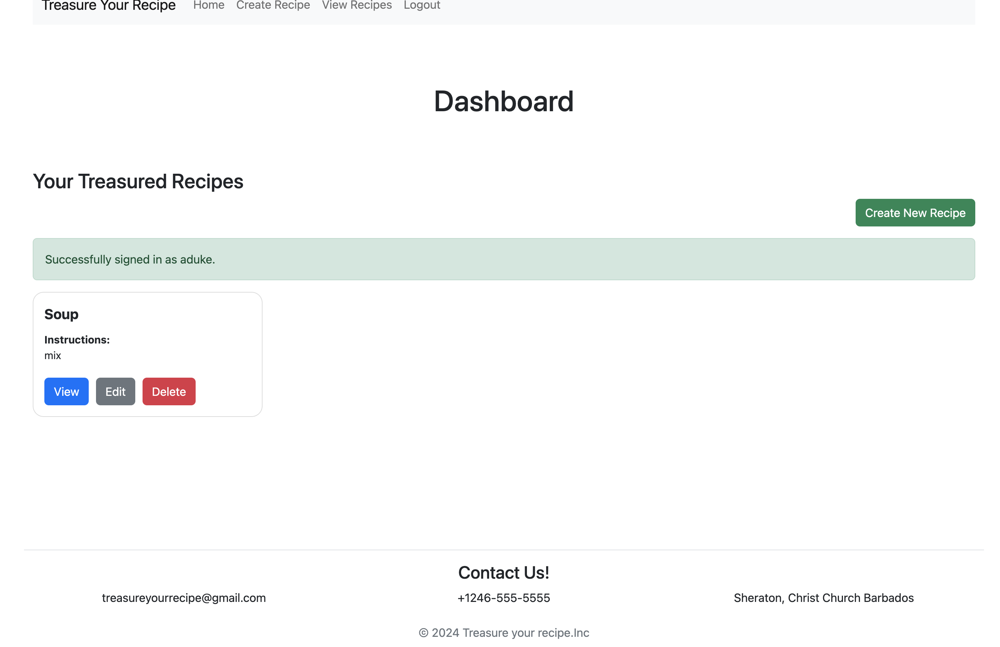
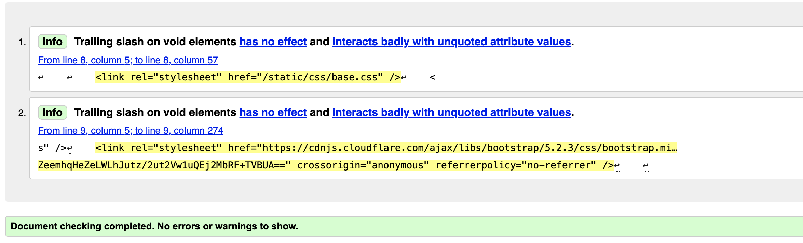

# Treasure Your Recipe

> [Live Site](https://treasure-your-recipe-812ee6481b1f.herokuapp.com/)

## Project Overview
This project was created due to my love for cooking. My family has hundreds for secret recipes sent down from generations. Saving these recipes or as i like to call it "treasuring these recipes' is very important to me. This gave me the idea to create an app that will allow me to store these recipes all these fantastic recipes in one place so you can never lose them. This allows users to have a quick and easy way to carry their recipes with them. With this app a user can never lose a Tearsured Recipe again!

## About App
This application allows users to add, delete, edit, view all and/or view one recipe. Customers can signup easliy using an emailaddress and password. The user is taken to the login home page. here the menu bar will be slightly different with links that will take you to your Dashboard. Here to can start creating your recipes. If you may need to delete a recipe you will be prompted to confirm that you are sure you want to delete. Once this is confirmed the recipe will be deleted and a message will appear that the action was successful. 
Users can only view the recipes they have created. This is also the case for any action taken to the recipes.. for example only the creator of a recipe can view or delete. This ensures security throughout the application. The app was created with just enought to to make the client happy and have workable CRUD functionality. From here we can expand this app into something larger.

## Color Scheme 
I decided to go with a more genertic approach, using bootstrap color conventions to style the buttons on the page. This gives a user friendly feeling to the site with with colors that are used by most web app users.

## Planning
### Tools Used:
- Wireframes
- Agile Approach (Moswco) (MVP) (User stories)
- Code Institute Learning vidoes

## Wireframes

- Landing page

- Dashboard

- Create Recipe Page

## User Stories
> [Link here to user Stories on github](https://github.com/AyishaSandiford/treasure-your-recipe-pp4/issues?q=is%3Aissue+is%3Aclosed)

## Features

Screenshot of The Login Form

 

Screenshot of The Signup Form

 

Screenshot of The Create recipe Page

 

Screenshot of The View Page

 

Screenshot of The Dashboard message

## Future Features
This application was created with minimal functionality (MVP). Just enought to 
present to the client to help get a general idea of sites functionality.
The intendtion of this application is to continue to build on it allowing
more features in the future.
See some of the Furtureideas listed below:

- The ability to add an image of the final dish to your created recipe
- Share your recipes with others 
- Other users can commit, like or dislike your recipe
- When creating a recipe and you accidently lose the page, what was entered wi;; be save to draft so you can contiune at and not lose you information.
- Choose from a list of food cartaegories

## Langueges / Frameworks Used
- HTML5
- CSS
- PYTHON
- BOOTSTRAP5
- DJANGO

## Agile Deveploment 
The project was built following Agile Principle. Epic stories were create and placed into todo's and draged across until completion.

## Testing
The Site was fully tested. This was done manually. See table below

| Test                                  | Action                                                                                       | Result |
| ------------------------------------- | -------------------------------------------------------------------------------------------- | ------ |
| URL loads                             | Enter the website URL into a browser and press Enter.                                        | PASS   |
| Create a recipe              | Click the Create recipe button        | PASS   |
| Delete a recipe                  | Click the deleteb button  a message will appear askin g if you are sure you want to delete      | PASS   |
| Edit a recipe  | Click the edit button and edit a perviously created recipe. ckick updae     | PASS   |
| View   | Using the recipe id you can view one individual recipe | PASS   |

## Site Testing 

- CI Python Validation Results

- CSS Validator

- HTML Validator

- Light House Mobile

- Light House Desktop

## Bugs

## Validator Testing

- HTML

No errors were returned when passing through the official W3C Validator.
 

#### CSS

No errors were returned when passing through the official (Jigsaw) Validator [Results](https://jigsaw.w3.org/css-validator/validator?uri=https%3A%2F%2Fayishasandiford.github.io%2Fyogawithme-pp1%2Findex.html&profile=css3svg&usermedium=all&warning=1&vextwarning=&lang=en)

- Lighthouse

I generated a lighthouse report on both desktop and mobile view. The Performance low score is due to the embedded youtube videos used on my site. 
Solution - This can be resolved by adding a placeholder so that the page can load more quickly and then using javascript to dynamically add the embedded YouTube iframe to the page.

Below is the score of the lighthouse generated report of the About Us page
No videos were used on this page. This report was good. 
  

## Deployment 
1) Create a Heroku account by going to https://signup.heroku.com/
2) Create a new app by clicking the "New" button in the top right corner and then click "Create new app".
3) Enter a name for the app and select the region closest to you.
4) Click the "Create app" button.
5) Select "settings" from the top menu.
6) Click the "Reveal Config Vars" button.
7) Enter the following environment variables with your values:
SECRET_KEY
DEBUG
DATABASE_URL
8) Click buildpacks from the top menu.
9) Add the following buildpacks:
heroku/python
10) Click the "Deploy" tab from the top menu.
11) Click the "Connect to GitHub" button.
12) Search for your repository and click the "Connect" button.
13) Click the "Enable Automatic Deploys" button.
14) Click the "Deploy Branch" button.
15) Click the "View" button to launch the app.

## Other Notes
The Secret key was initialy in the setting.py file. This was place here for testing purposes. However this has now been changed and placed into the evn.py which was placed in the git ignore. This prevents this sensitive information from being pushed up to github and viewed by others. 

## Credits
### Honorable Mentions
This project could not have happened without the support of the following people listed in no particular order:

- David Bowers - My Mentor. For believing in me.
- Omar Fitzpatrick - My brother for always being there to answer a quick question, help with planning and support!!!
- Kyle Skeete - For always welling to help suport
- Code Institute - For giving me this opportunity and providing me with unlimited resources, step by step videos and tons of support
- The Code Institute Slack community where I was able to find answers to problems
And my amazing Husband Steven Rawlins who has been my rock and my biggest cheer leader from day one. Thank you for your continuous support every step of the way!

## General reference:

The project was influenced by the Code Institutes code along project called 'I think therefore I blog'. 
I relied upon [W3schools](https://www.w3schools.com/), and stack overflow for general references throughout this project.

## Content

- Text was generated by Chat Gpt
- Title icon used was from [Font Awesome](https://fontawesome.com/) 

## Images
- Image was taken from [Freepik](https://www.freepik.com/) by pressfoto

